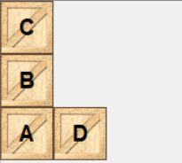
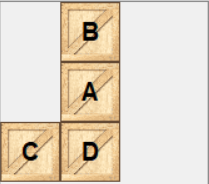
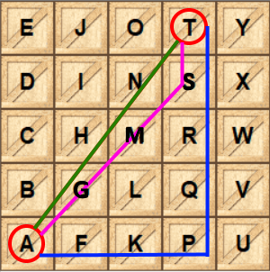
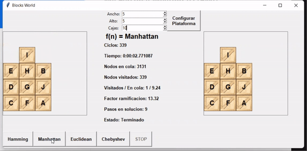

# Blocks World

## Historia y Descripcion de Blocks World

Blocks World es uno de los problemas mas famosos de planificación con inteligencia artificial. 

Consiste en un conjunto de bloques apilados unos encima de otros. El objetivo es mover cualquier bloque hacia otra posición siguiendo un conjunto de restricciones:

- Solo se puede mover un bloque a la vez
- Solo se puede mover un bloque que no tenga bloques encima
- Un bloque se puede colocar encima de un espacio vacio o de otro bloque

En la siguiente imagen se muestra una plataforma inicial de ejemplo.
El objetivo es mover los bloques en una secuencia tal que sigan las restricciones definidas y que apilen los bloques hasta llegar a la configuracion de ejemplo siguiente:





Blocks World es un problema de planificacion en IA. Esta rama de la IA estudia la creacion de estrategias o planes de accion. 

Este tipo de problema se puede resolver siguiendo IA simbolica, en la que el dominio del problema puede ser modelado como un conjunto de simbolos sobre los cuales se puede razonar y operar mediante un conjunto de reglas.

> Un ejemplo mas popular de la aplicacion de IA simbolica es un sistema experto


# Implementacion de `A*` para resolver Blocks World

Para esta implementacion se utilizo el algoritmo de busqueda informada `A*` con cuatro diferentes distancias heuristicas.

La busqueda con `A*` utiliza una cola priorizada para mantener registro del siguiente nodo a visitar. 

La funcion de evaluacion se define de la siguiente manera:

```
f(n) = g(n) + h(n)
```
Donde:

- El costo `g(n)` es la profundidad del arbol a la que esta el nodo. O visto de otra manera el costo del nodo padre mas 1 (`g(n) = g(n-1) + 1`). 
    - De esta manera todos los hijos de un nodo aumentan en `1` su costo en relacion al padre.

- Dado el tablero siguiente, la distancia heuristica `h(n)` entre el bloque `A` y el bloque `T` es:
    - Chebyshev (linea fucsia): el maximo de los componentes del vector. Tambien se puede pensar en el valor del cateto mayor.
    - Euclideana (linea verde): la distancia en linea recta.
    - Manhattan (linea azul): la distancia siguiendo solo lineas en ángulos de 90°. Tambien se puede pensar en la suma del valor de los dos catetos.
    - Hamming: el numero de bloques a cambiar para convertir el tablero inicial en el final.




# Aplicacion e Interfaz

La interfaz permite configurar una configuracion inicial en la que se puede definir la cantidad maxima de pilas de bloques, la cantidad maxima de bloques por pila, y la cantidad de bloques.

El conjunto de bloques en el cuadro de la izquierda es la plataforma inicial, y el de la derecha es la plataforma final. 

Ambos cuadros permiten mover bloques de manera aleatoria para reconfigurar el estado inicial y final a discrecion. Colocar un bloque encima de otro, sube todos los bloques para hacer espacio al nuevo bloque. La solucion siempre se realiza dentro de las restricciones del dominio del problema.

Al dar click en alguno de los botones de la parte inferior se buscara la solucion utilizando la heuristica del boton seleccionado. 

En la parte central se muestra los datos en tiempo real de la busqueda de `A*`.

Al finalizar se muestra la animacion de los pasos encontrados para resolver el problema definido.


